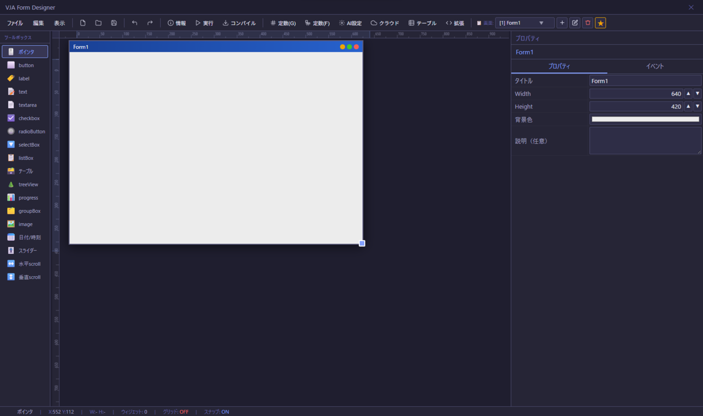

# 🎨 VJA Form Designer

> **「日本語で書いたら、アプリが動く。」**
> YAML で仕様を書く → ローカル AI が JavaScript を生成 → デスクトップアプリが完成。

> ### 🪄 アプリ開発に必要な「主要4要素」すべてを AI 雛形生成でカバー
> **画面（フォームレイアウト）／イベント処理（YAML→JavaScript）／DB テーブル定義／入力バリデーション** —
> この4つすべてに「✨ 依頼文を日本語で書く → AI が雛形（YAML/JSON/コード）を自動生成 → 人間が仕上げる」という同じ導線を用意しました。
> YAML の書き方を覚える前に、まず**日本語で「作りたいもの」を書くだけ**でアプリの骨格が組み上がります。

<p align="center">
  
</p>

---

## 💡 VJA とは？

**VJA（Visual JavaScript for AI）** は、VB6 や Excel マクロの現代的な後継として設計された、デスクトップ GUI アプリ開発ツールです。

### ノーコードではありません。でも、あなたにも作れます。

「AIがあればノーコードで誰でもアプリが作れる」というのは神話です（数万行規模のプロジェクトは現実的に困難）。  
しかし **VBA 経験者・元エンジニア・IT 好きな社内 SE** なら、VJA で普通にアプリが作れます。

その理由は設計にあります。

- **YAML で仕様を書く** — 自然言語で構造化されているので、誰が書いても一定の品質になる
- **AI が JavaScript を生成する** — 1 イベント = 1 回の LLM 呼び出し = 短いコード。ローカル LLM でも十分
- **動かして確認する** — 失敗したら AI に修正を頼む。繰り返すうちにプログラムが読めるようになる

YAML は「人間と AI の共通言語」です。昔のフローチャートや COBOL の仕様書のように、**YAML が仕様書であり、AI への命令書でもある**という設計思想に基づいています。

### VJA が解決する3つの課題

- **「仕様書がない」問題** — YAML が設計書として残るため、「ソースコードが仕様書」という後々致命的になる問題を防げる
- **「プログラムは面倒」問題** — 仕様をメモする感覚で YAML を書くだけで AI がコードの雛形を生成。実装より設計に集中できる
- **「学習の壁」問題** — 生成されたコードを読み・修正するサイクルを繰り返すことで、プログラムが自然に身につく

VJA は「小規模アプリ・社内システム」レベルにおいて、VBA 経験者・元エンジニア・これからプログラムを学びたい人たちの**登竜門的な存在**を目指しています。

---

## 🤖 ハイブリッド対応：ローカル LLM ＆ 超低コスト クラウド API

VJA は **「完全無料のローカル LLM」** と **「超低コストな OpenAI 互換 クラウド API」** の双方に最適化されています。

### 💡 ローカル LLM 環境がない PC でも大活躍！

「ローカルで AI を動かせるハイスペック PC がない…」という場合でも諦める必要はありません。

OpenAI の最新軽量・高効率モデル（**GPT-5.6 Luna** や **GPT-4o-mini** など）を利用すれば、**ほぼタダ同然の超低コスト**で VJA をフル活用できます。

#### なぜ VJA × クラウド API はこんなに安いのか？

Cursor や Claude Code のような全コードベースを解析する開発ツールでは毎月数千円〜数万円のサブスク費用がかかります。  
一方 VJA は **「1イベント＝数十〜数百行の小規模コード生成」** にタスクを徹底的に細分化してリクエストを送ります。

- 1リクエストの消費トークン数が極めて少なく、1回の生成コストは **約 0.01〜0.1 円** レベル
- 画面1つ、アプリ1つを完成させるまで何度も生成・修正を繰り返しても **合計で数円〜数十円** 程度
- サブスク不要、使った分だけの従量課金で「全然コストがかからない」

ハイスペック PC をお持ちの方は **ローカル LLM（月額 0 円・完全プライベート）**、軽量ノート PC や手軽に最高精度を試したい方は **OpenAI API（爆速・超低コスト）** と、環境に合わせて自由にお選びいただけます。

### 動作環境・モデル比較

| 方式 | 環境 | 推奨モデル | 特徴・コスト |
|------|------|-----------|------------|
| **クラウド API** | あらゆる PC（軽量ノート等） | **GPT-5.6 Luna** / **GPT-4o-mini** | **超低コスト（数円/アプリ）**・超高速・高精度 |
| **ローカル LLM** | Mac (M1以降 16GB) | **Qwen2.5-7B-coder** (mlx-lm) | **完全無料 (0円)**・完全プライベート |
| **ローカル LLM** | Copilot+ PC (Snapdragon) | **Qwen2.5-7B-coder** (Foundry) | **完全無料 (0円)**・NPU駆動 |
| **ローカル LLM** | Linux / GPU環境 | **gemma4-26b-a4b** / **Qwen2.5** | **完全無料 (0円)**・ローカル環境 |

### 実際の動作例

以下の YAML を書いて AI を実行すると：

~~~yaml
# イベント: Click (tableViewButton)
説明: horse_info テーブル内容を条件に従い tableView に表示させる。
利用テーブル:
  - horse_info

アクション:
  - horse_info テーブル内容をsqlで以下の条件で検索し、その結果を tableView に表示させる:
    - 前提条件: ローディング表示
    - searchText に文字列が入力されている場合: searchSelect のカラム名を searchText 文字列で「部分一致」検索
    - それ以外: 条件なしで検索

正常終了: なし
エラー終了: ログと、トーストにエラーを出力
~~~

M1 Mac（Qwen2.5-7B-coder / mlx-lm）が生成したコード：

~~~javascript
vja.ui.loading(true, "処理中...");

let sql = "SELECT * FROM horse_info";
let params = [];

if (vja.widget.get("searchText")) {
  const searchColumn = vja.widget.get("searchSelect");
  sql += ` WHERE ${searchColumn} LIKE ?`;
  params.push(`%${vja.widget.get("searchText")}%`);
}

try {
  const result = await vja.db.query(sql, params);
  vja.widget.set("tableView", result);
} catch (error) {
  console.error("エラーが発生しました: ", error);
  vja.notify.toast("エラーが発生しました。", 3000);
} finally {
  vja.ui.loading(false);
}
~~~

---

## ✨ 主な機能

### 🎨 フォームデザイナー
- VB スタイルのドラッグ＆ドロップ UI
- 複数フォーム（画面）管理・切り替え
- リアルタイムプレビュー
- **AI 画面デザイン自動生成**: 「✨ YAMLドラフト」タブに日本語で要望を書くだけで、AIが画面デザインYAML（説明/レイアウト/入力項目/アクション）のドラフトを生成 → そのYAMLからウィジェット配置（x, y, w, h）を自動計算。テンプレートダイアログ（検索一覧・マスタ保守・伝票明細等）からワンタップ選択、4pxグリッドスナップ・自動整列補正も搭載

### 🤖 AI コード生成
- 「✨ YAMLドラフト」タブに日本語でやりたいことを書くだけで、AIがイベント処理YAMLのドラフトを生成 → そのYAMLから AI が JavaScript を生成
- ローカル LLM（llama.cpp / mlx-lm / Foundry Local）対応
- OpenAI 互換 API であればクラウド API にも対応
- AI接続設定は「📁 プロジェクト固有」「🌐 プロジェクト共通（他プロジェクトからも再利用可）」の2種類のプリセットとして保存・切り替え可能
- 拡張ランタイムの AI 向けドキュメント自動生成

### 📦 コンパイル・配布
- ワンクリックで Electrobun ネイティブアプリを生成
- Linux / macOS / Windows 向けに配布可能
- 配布先に Bun のインストールは不要

### 🗄️ データ管理（SQLite 内蔵）
- テーブル定義をビジュアルエディタで管理
- **AI テーブルスキーマ自動生成**: 「✨ AI生成」で、依頼文＋テーブル名/説明からカラム構成（列名・型・NOT NULL・主キー・インデックス・デフォルト値）の雛形を自動生成
- マスターデータを CSV でインポート（gzip 圧縮してプロジェクトに同梱）
- YAML に書くだけで AI が SQLite3 アクセスコードを生成

GAS や AWS Lambda などの無料・低価格クラウドサービスは便利ですが、**RDBMS が使えない**という制約があります。VJA は SQLite3 内蔵で、この問題を解決します。

| | GAS / AWS Lambda 無料枠 | VJA |
|---|---|---|
| RDBMS | ❌ 利用不可 | ✅ SQLite3 内蔵 |
| テーブル定義 | 手動実装が必要 | ✅ ビジュアルエディタで管理 |
| マスターデータ | 手動実装が必要 | ✅ CSV インポート対応 |
| コスト | 無料〜 | ✅ 無料（ローカル実行） |

クラウドインフラと連動すれば、外部連携によりローカルを超えたアプリ作成も可能です。

- AWS / GCP / Azure のクレデンシャルを安全に管理（AES-GCM 暗号化）
- `vja.getCloudInfraCredential("AWS", "s3")` で取得、AI 生成コードでもそのまま使える

### ⚙️ 拡張ランタイム
- プロジェクト固有の JavaScript ライブラリを定義
- AI がその API を理解してコード生成に活用

### ✅ バリデーション定義
- 入力チェックルールを GUI でフォーム単位に定義・管理
- **AI バリデーションルール自動生成**: 「✨ AI生成」で、依頼文＋定義名/説明＋フォーム内の入力系ウィジェット一覧からルール一覧（対象ウィジェット・チェック種別・エラーメッセージ等）の雛形を自動生成
- YAML に `検証: 定義名` と記載するだけで AI 生成コードの先頭に自動挿入
- AI がバリデーションロジックを書く必要がなく、ローカル LLM でも安定動作

---

## 🛠️ ウィジェット一覧

| カテゴリ | ウィジェット |
|---------|-------------|
| 入力 | text / inputType / textarea / checkbox / radioButton / datepicker |
| 表示 | label / picture |
| 選択 | listBox / selectBox |
| レイアウト | groupBox / テーブル（datagrid） |
| スクロール／スライダー | hscroll / vscroll / slider / progressbar |
| アクション | button |

---

## 📋 動作環境

| 項目 | バージョン |
|------|-----------|
| Bun | 1.3.14 以上 |
| Electrobun | latest |
| OS | macOS / Linux / Windows |

> ⚠️ **Windows on Snapdragon X（ARM64）** の場合、Electrobun が未対応のため x86 版 Bun をインストールしてエミュレーション実行が必要です。  
> bun.js の Windows11（x64）ランタイム zip をダウンロード・展開し、展開先を環境変数 PATH に追加することで実行できます。

---

## ⚡ セットアップ

```bash
# 1. リポジトリをクローン
git clone https://github.com/maachang/vja.git
cd vja

# 2. 依存パッケージをインストール
bun install

# 3. 開発モードで起動
bun run dev
```

### 配布用ビルド

```bash
bun run build
```

### ユニットテスト

```bash
bun run test
```

Electrobunのウィンドウ/DOMに依存しない純粋なロジック（RPCラッパー・CSVパース・ファイル操作ハンドラ等）が対象です。UI操作を伴う部分は引き続き手動確認が必要です。

### Linux での保存ダイアログ

`zenity`（GNOME）または `kdialog`（KDE）が必要です。

```bash
# GNOME 環境
sudo apt install zenity

# KDE 環境
sudo apt install kdialog
```

### Windows での追加インストール

- **webview2**（未インストールの場合、vja 起動時に案内が表示されます）

---

## 🤖 ローカル LLM のセットアップ

### Mac（Apple Silicon）— mlx-lm

```bash
brew install pipx
pipx ensurepath
pipx install mlx-lm
```

```bash
# 起動スクリプト例
MODEL=Qwen2.5-Coder-7B-Instruct-4bit  # 8GB Mac
# MODEL=gemma-4-e4b-it-OptiQ-4bit       # 16GB Mac
mlx_lm server --model mlx-community/${MODEL} --port 8080 --max-tokens 16384 --temp 0
```

モデル一覧: https://huggingface.co/models?search=mlx-community

- Mac（Apple Silicon）: [セットアップ方法詳細](docs/localLlm/mac-mlx-lm-setup.md)

### Windows 11（Copilot+ PC / Snapdragon X）— Foundry Local

```powershell
winget install Microsoft.FoundryLocal
foundry service set --port 8080
foundry model run qwen2.5-coder-7b
```

- Windows AI PC（Copilot+ PC）: [セットアップ方法詳細](docs/localLlm/win-foundry-setup.md)

### Linux / その他 — llama.cpp / Ollama

OpenAI API 互換であればどのサーバーでも接続可能です。

---

## 🤖 AI コード生成の使い方

YAML でイベントの指示を書くだけで、AI が JavaScript を生成します。

```yaml
# ボタンクリック時の処理
アクション:
    - 「YES NO」の確認ダイアログで「これでいいですか？」と表示して下さい:
        - YES: この場合「YES!!」と言うダイアログを表示して下さい。
        - NO: この場合「NO・・・」と言うダイアログを表示してください。

正常終了: ログで「終了しました」として下さい。
```

生成されたコードはそのまま実行可能。動かない場合は AI に修正を依頼できます（今後 AI アシスタント機能を予定）。  
**この「作る → 動かす → 直す」サイクルを繰り返すことで、プログラムが自然に読めるようになります。**

### 🔍 生成コードの自動検証（ガチャ対策）

小型ローカル LLM は便利な反面、存在しない API を創作したり、`await` を忘れたり、たまに壊れたコードを返すことがあります。VJA では、AI が生成したコードを画面に反映する前に、複数の機械的なチェックを自動で通します。

- **構文チェック** / **API ホワイトリスト検証**（`vja.*` が実在するAPIか、フロント/バックエンドで分離してチェック）
- **禁止パターン検出**（`require`、ヘルパー関数定義、`.then()`/`.catch()`、`window.alert` 等）
- **await 漏れ検出** / **未知のウィジェット名検出**
- **モック実行スモークテスト**：ダミー値を返す専用のモック VJA ランタイムと一緒に生成コードを実際に 1 回実行してみて、構文・API チェックでは拾えない実行時例外（`TypeError` 等）が起きないかを確認する

問題が見つかった場合、検出内容を添えて AI に自動で 1 回だけ修正を依頼します。それでも解消しない場合は、生成自体は止めずにコードを反映しつつ、該当箇所に指摘コメントと警告バナーを表示して人間の判断に委ねます（バナーからは何度でも再修正を依頼できます）。

同じ間違いを繰り返す場合は、**「🎲 ランダム性を上げて再生成」**ボタンでその場だけ `temperature` を上げて出力にブレを持たせることもできます。

> この検証は「構文的・構造的に明らかにおかしいか」「実行して即座に落ちないか」を機械的に確認するものであり、YAML の意図通りに正しく動くかまでは保証しません（分岐の全パターンを検証できるわけではないため）。詳細は[ユーザーガイド](docs/user-guide.md#7-ai-コード生成)を参照してください。

---

## 🧪 検証してわかったこと

VJA を実際に使い込んでいく中で、当初の想定を超えて分かってきたことをいくつか記録しておきます。

### 2年近く前の小型モデルでも実用的に動く

画面デザイン自動生成（YAML → ウィジェット配置）を **Qwen2.5-Coder-7B**（2年近く前にリリースされた 7B クラスのモデル）で試したところ、約20秒でフォーム一式（入力欄・ドロップダウンの選択肢・検索結果一覧のカラム構成まで含む）が生成できました。最新の大型モデルでなくても十分実用になる、というのは正直なところ想定以上でした。

これは、VJA の AI 生成タスクが徹底して「狭く・浅く」設計されていることが効いていると考えられます。

- **出力は決まった JSON スキーマのみ**（自然文の説明や理由づけを一切書かせない）
- **Few-Shot で具体例を1つ丸ごと提示**する（実際の依頼形式に近い実例があれば、小型モデルでも「型を真似る」だけで済む）
- **座標のはみ出し・重なり補正、値のフォールバックなどは VJA 側の後処理で担保**し、AI に完璧な計算をさせない

つまり「考えさせる」のではなく「決まったフォーマットに当てはめさせる」タスクに落とし込んでいるため、小型モデルでも十分にこなせる、という構造です。

### 推論（thinking）モデルより、Qwen2.5 のような非推論モデルの方が向いている可能性

さらに踏み込むと、こうした「型当てはめ」タスクにおいては、近年主流になっている推論（thinking）モデルよりも、Qwen2.5 のような**推論全盛以前の、指示に素直に従うタイプのモデル**の方がむしろ相性が良いのではないか、という感触を得ています。

- 推論モデルは出力前に長考する分、生成が遅くなりやすく、また出力に余計な説明や思考過程が混入するリスクもある
- 「決まった型に当てはめる」だけのタスクには、そもそも深い推論は不要
- 本プロジェクトの AI 接続設定に `thinking: false`（推論モードOFF）の項目を用意しているのも、VJA の生成タスクの多くが「推論を必要としない」性質のものであることの裏付けと言えます

大型・最新・高推論力なモデルほど良い、とは限らず、**タスクの切り出し方次第では、枯れた小型モデルの方が速く・安定して噛み合う**、という一例だと考えています。

### 「画面デザインYAML」と「イベント処理YAML」の組み合わせで、ほぼノーコードに近づく

1. 画面デザイン自動生成YAML → フォーム（画面）ができる
2. できたフォームのウィジェットに対して、イベント処理YAML → 検索・表示・登録などの JavaScript ができる

この2段階がどちらも「型にはまったフォーマットへの当てはめ」として機能するため、検索・一覧・登録・更新のような業務アプリの定番パターンであれば、**YAML の書き方さえ覚えれば、コードを1行も書かずに組み上げられる**という手応えがあります。

一方で、複雑な業務ロジックや独自の画面遷移フロー、外部API連携など「型から外れる部分」は、依然として JavaScript を読んで直す力が必要な領域です。VJA を「登竜門」と位置づけているのも、型にはまった部分は AI に任せつつ、そこから少しずつコードを読めるようになっていく、という段階的な学習導線を意図したものだと捉えています。

実際に「画面デザインYAMLドラフト生成」「イベントYAMLドラフト生成→JS生成」「テーブルAI生成」「検証（バリデーション）AI生成」の4つを組み合わせて、ログイン・ユーザ登録機能をほぼノーコードで組み上げた実例を[サンプルウォークスルー](docs/sample-login-nocode.md)にまとめています。

### ローカル LLM（DeepSeek-Coder-V2-Lite）でも「ガチャ」ではなく安定して動く

上記のログイン・ユーザ登録サンプルは、**ローカル LLM の DeepSeek-Coder-V2-Lite** だけで最初から最後まで組み上げました。

以前は「小型・軽量級のローカル LLM は、たまに壊れたコードや存在しない API を創作してしまう」という、いわゆる**「AI生成ガチャ」**な状態がありました。しかし、本 README の「🔍 生成コードの自動検証（ガチャ対策）」（上述）で述べている**機械的チェック＋自動リトライの仕組み**を挟むことで、DeepSeek-Coder-V2-Lite のような比較的知識量重視・指示追従性がやや弱いモデルでも、最終的に構文・API的に正しいコードへ収束するようになりました。

つまり「モデルの生成品質そのもの」に依存するのではなく、**「生成 → 機械的検証 → 問題があれば自動で1回だけ修正依頼」という仕組み側で品質を担保する設計**が、ローカル LLM 運用の実用性を大きく左右する、ということが実地検証で裏付けられた形です。

### システムプロンプトは「渡せば渡すほど良い」わけではない

イベント処理コード生成用のシステムプロンプトは、当初 14,146 文字ありましたが、以下の対策で最終的に **7,204 文字（約半分）** まで軽量化しました。

- 実際には未使用の`scope`フィールドの除去、完全同一シグネチャ関数の統合（例: `vja.trigger.click/focus/blur/...`をまとめて1つの説明に）
- `vja.widget`/`vja.trigger`/`vja.ui.loading`/`vja.app`/`console`等、ほぼ全イベントで使う「必須API」と、`vja.form`/`vja.session`/`vja.file`/`vja.http`等の「任意API（イベント単位でON/OFF）」を分離し、使わないカテゴリの説明はそもそも渡さない
- `vja.event.*`（`ev.type`判定等）も任意カテゴリに分離しつつ、`KeyDown`/`KeyUp`/`RowClick`/`HeaderClick`では実質必須のため常時有効に固定

この軽量化の過程で、**知識量は豊富だが指示追従性が弱いモデル（例: DeepSeek-Coder-V2-Lite）ほど、プロンプト中の情報量が多いこと自体がノイズとなり、無関係な典型パターンを模倣して誤ったコードを生成しやすくなる**、という傾向が確認できました。逆に Qwen2.5-Coder のような指示追従性の高いモデルでは、情報量が多くても明示的な指示を優先して読めるため、この副作用が出にくい傾向があります。

つまり「最新・高性能・大容量な情報を渡せるモデルほど良い」とは限らず、**モデルの指示追従性に応じて、渡す情報量そのものを絞り込む**というチューニングが、生成品質に直結するケースがある、という実例です。この軽量化と並行して、生成例文中の誤り（DOM直接アクセスを示唆する誤ったサンプルコード等）も複数見つかり修正しており、そうした地道なプロンプトの精度向上も、体感的な生成品質改善に寄与しています。

---

## 📖 vja.* API（抜粋）

```javascript
// DB 操作
const rows = await vja.db.query('SELECT * FROM users WHERE id = ?', [id]);
await vja.db.execute('INSERT INTO users (name, age) VALUES (?, ?)', [name, age]);

// ウィジェット操作
const name = vja.widget.getValue('txtName');
vja.widget.setValue('lblResult', '処理完了');

// 画面遷移
vja.form.navigate('Form2');

// 外部 HTTP（Bun 経由 / タイムアウトなし）
const res = await vja.fetch('https://api.example.com/data');
const data = await res.json();

// クラウド認証情報
const cred = await vja.getCloudInfraCredential('AWS', 's3');

// バリデーション（GUI定義を実行）
if (!await vja.validate.run('入力チェック')) return;
```

---

## 🏗️ アーキテクチャ

```
フォームデザイナー (WebView)
    ↕ RPC (request/response ベース・呼び出し単位でID対応付け)
Bun.js メインプロセス
    ├── SQLite (データベース)
    ├── ファイル I/O
    ├── vja.fetch（Bun 経由の汎用 HTTP / WebKit タイムアウト回避）
    └── プロジェクト実行ウィンドウ (WebView)
            ↕ RPC
        vja-runtime.js (vja.* API)
```

> Bun 経由の `vja.fetch` を採用することで、Apple Silicon Mac の WebKit 60 秒タイムアウト問題を根本解決しています。

---

## 📁 ファイル構成

```
vja/
├── electrobun.config.ts       # Electrobun ビルド設定
├── package.json
└── src/
    ├── bun/
    │   ├── index.ts                 # メインプロセス（ウィンドウ生成・RPC定義）
    │   ├── project-runner.ts       # プロジェクト実行ウィンドウの共通処理（index.ts・standalone-index.tsで共有）
    │   ├── fs-rpc-handlers.ts      # ファイル/ディレクトリ操作RPCハンドラ共通実装
    │   ├── bun-utils.ts            # CSVパース・gzip展開等の共通ユーティリティ
    │   ├── logger.ts                # ロガー
    │   ├── db-manager.ts           # SQLite 管理
    │   ├── copy-compile-assets.ts  # コンパイル資材コピー
    │   └── standalone-index.ts     # コンパイル済みアプリのエントリポイント
    ├── mainview/
    │   ├── index.html              # フォームデザイナー（静的HTML・スクリプト読み込み）
    │   ├── init-params.js          # 静的定義値の集約（全ファイルで最初に読み込む）
    │   ├── vja-defs.js             # 状態管理・ウィジェット定義・共通ユーティリティ
    │   ├── vja-designer.js         # デザイナー本体（描画・選択・プロパティパネル）
    │   ├── vja-modal.js            # モーダル基盤・Undo/Redo・削除/複製
    │   ├── vja-yaml-editor.js      # YAML/JSエディタ・AI生成
    │   ├── form-design-templates.js # 画面デザイン依頼（YAML）テンプレート定義
    │   ├── vja-editor-utils.js     # エディタ共通ユーティリティ
    │   ├── vja-mock-runtime.js     #モック共通ユーティリティ
    │   ├── vja-save.js             # 保存・開く・実行・マルチフォーム管理
    │   ├── vja-table-validation.js # 定数・テーブル・バリデーション編集
    │   ├── vja-app-config.js       # フォーム定数・アプリイベント・クラウド設定等
    │   ├── vja-ui.js               # キーボード・ルーラー・INIT（最後に読み込む）
    │   ├── bridge.ts               # Webview RPC ブリッジ
    │   ├── bridge-common.ts        # RPC ブリッジ共通処理
    │   ├── project-bridge.ts       # プロジェクト実行ウィンドウ RPC
    │   ├── vja-runtime.js          # vja.* API ランタイム
    │   └── prompt-def.js           # AI プロンプト定義
    └── shared/
        └── types.ts                # Bun ↔ Webview 共有 RPC 型定義
```

---

## 📖 ドキュメント

- [ユーザーガイド](docs/user-guide.md)
- [VJA YAML プログラム命令ガイド（startup）](docs/yaml-guide-startup.md)
- [VJA YAML プログラム命令ガイド（Engineer）](docs/yaml-guide-engineer.md)
- [VJA 画面デザイン自動生成 YAML ガイド](docs/yaml-guide-form-design.md)
- [サンプルウォークスルー: ログイン・ユーザ登録機能をほぼノーコードで作る](docs/sample-login-nocode.md)
- [Mac ローカル LLM セットアップ（mlx-lm）](docs/mac-mlx-lm-setup.md)
- [Windows ローカル LLM セットアップ（Foundry Local）](docs/windows-foundry-local-setup.md)

---

## 📝 ライセンス

MIT License

---

<p align="center">
  <b>VJA Form Designer</b> — 「日本語で書いたら、アプリが動く。」<br/>
  Built with ❤️ using Electrobun + Bun.js
</p>
