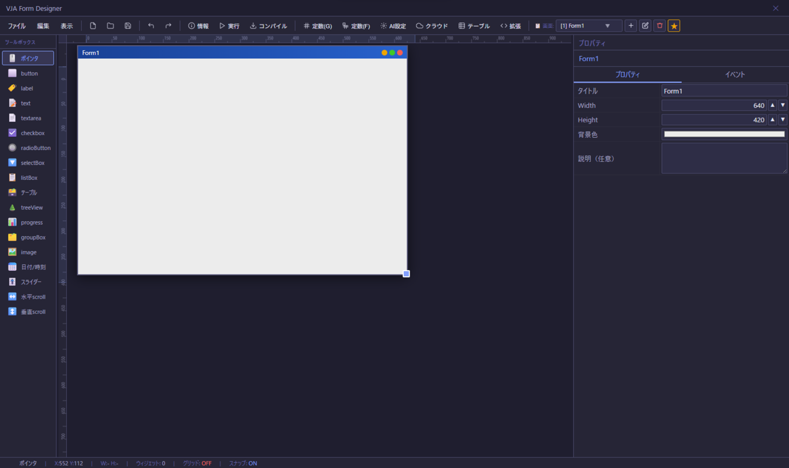

# VJA Form Designer — 利用者マニュアル

> このマニュアルは「VJA を使ってアプリを作る人」向けのガイドです。

---

## 目次

1. [画面構成](#1-画面構成)
2. [プロジェクトの作成・保存・読み込み](#2-プロジェクトの作成保存読み込み)
3. [フォームの管理](#3-フォームの管理)
4. [ウィジェットの配置](#4-ウィジェットの配置)
5. [ウィジェットの種類と設定](#5-ウィジェットの種類と設定)
6. [イベントの設定](#6-イベントの設定)
7. [AI コード生成](#7-ai-コード生成)
8. [定数の管理](#8-定数の管理)
9. [テーブル（データベース）の管理](#9-テーブルデータベースの管理)
10. [バリデーション定義の管理](#10-バリデーション定義の管理)
11. [アプリイベント（起動・終了処理）](#11-アプリイベント起動終了処理)
12. [拡張ランタイム](#12-拡張ランタイム)
13. [クラウドインフラ設定](#13-クラウドインフラ設定)
14. [AI 接続設定](#14-ai-接続設定)
15. [プロジェクト情報の設定](#15-プロジェクト情報の設定)
16. [プロジェクトの実行](#16-プロジェクトの実行)
17. [コンパイル（実行ファイルの生成）](#17-コンパイル実行ファイルの生成)

---

## 1. 画面構成

VJA を起動すると以下の画面が表示されます。

### 画面イメージ:

<p align="center">
  
</p>

### 説明:

```
┌─────────────────────────────────────────────────────────┐
│  ツールバー（実行・コンパイル・定数・AI設定・その他）        │
├──────────┬──────────────────────────────┬───────────────┤
│          │                              │               │
│ ウィジェット │      フォームキャンバス        │  プロパティ   │
│  パネル   │   （ここにウィジェットを配置）    │   パネル     │
│  (左側)  │                              │   (右側)     │
│          │                              │               │
├──────────┴──────────────────────────────┴───────────────┤
│  ステータスバー（フォーム名・ウィジェット数・座標情報）       │
└─────────────────────────────────────────────────────────┘
```

| エリア | 説明 |
|--------|------|
| ツールバー | 実行・保存・各種設定ダイアログを開くボタン |
| ウィジェットパネル | 配置できるウィジェットの一覧 |
| フォームキャンバス | 実際にウィジェットを配置・編集するエリア |
| プロパティパネル | 選択中のウィジェットの設定を編集するエリア |
| ステータスバー | 現在の状態（フォーム名・座標など）を表示 |

※現状MacだとDevTool(ブラウザのF12で表示される内容)これを利用すると「表示がおかしくなる」不具合が存在します。

これの回避方法は
- Mac（DevTools）: 初回はDevToolsがドッキングモードで開く場合があります。左上の「別ウィンドウ」アイコンをクリックして切り替えると、以降は別ウィンドウで開くようになります(１回目はこれを設定して vja を起動しなおす）。

---

## 2. プロジェクトの作成・保存・読み込み

### 新規プロジェクトの作成

ツールバー左端の **「新規」** ボタンをクリックすると新しいプロジェクトが作成されます。

> ⚠️ 未保存の変更がある場合は確認ダイアログが表示されます。

### プロジェクトの保存

ツールバーの **「保存」** ボタン（または `Ctrl+S`）をクリックします。

- **初回保存時**：ファイル保存ダイアログが開きます。プロジェクト名が設定されていればそのファイル名がデフォルトになります
- **2回目以降**：前回と同じファイルに上書き保存されます

保存形式は `.vjaproj`（JSON 形式）です。

### プロジェクトの読み込み

ツールバーの **「開く」** ボタンをクリックし、`.vjaproj` ファイルを選択します。

---

## 3. フォームの管理

VJA では複数の「フォーム（画面）」を1つのプロジェクトで管理できます。

### フォームの追加

左サイドバー下部の **「画面一覧」** セクションにある **「＋ フォーム追加」** をクリックします。

### フォームの切り替え

「画面一覧」のフォーム名をクリックすると、そのフォームに切り替わります。

### フォームの設定

フォームが選択されている状態（ウィジェット未選択）でプロパティパネルを確認すると、以下が設定できます。

| 項目 | 説明 |
|------|------|
| フォーム名 | 画面の名前（`vja.form.navigate()` で使用する名前） |
| 幅 / 高さ | フォームのサイズ（ピクセル） |
| 背景色 | フォームの背景色 |
| フォント設定 | フォームのデフォルトフォント |
| 定数 | このフォーム専用の定数（グローバル定数より優先） |

### スター（起動フォーム）の設定

「画面一覧」でフォーム名の右にある ★ ボタンをクリックすると、そのフォームがアプリ起動時の最初の画面になります。

---

## 4. ウィジェットの配置

### 配置方法

1. 左側の **ウィジェットパネル** で配置したいウィジェットをクリック
2. フォームキャンバス上でクリックすると配置されます

### 移動

ウィジェットをドラッグして移動できます。

### リサイズ

ウィジェットを選択すると四隅にハンドルが表示されます。ハンドルをドラッグしてリサイズできます。

### コピー・貼り付け・削除

選択したウィジェットに対して以下のショートカットが使えます。

| 操作 | ショートカット |
|------|--------------|
| コピー | `Ctrl+C` |
| 貼り付け | `Ctrl+V` |
| 削除 | `Delete` / `Backspace` |
| 元に戻す | `Ctrl+Z` |
| やり直し | `Ctrl+Shift+Z` |

### 複数選択

`Ctrl` を押しながらウィジェットをクリックすると複数選択できます。

---

## 5. ウィジェットの種類と設定

### ウィジェット一覧

| アイコン | 種類 | 説明 |
|---------|------|------|
| ⬜ | **button** | クリック可能なボタン |
| 🏷️ | **label** | テキストラベル（読み取り専用） |
| 📝 | **text** | 1行テキスト入力（パスワード・数値等の型指定可） |
| 📄 | **textarea** | 複数行テキスト入力 |
| ☑️ | **checkbox** | チェックボックス |
| 🔘 | **radioButton** | ラジオボタン（グループ設定可） |
| 🔽 | **selectBox** | ドロップダウン選択 |
| 📋 | **listBox** | リスト選択 |
| 🗃️ | **テーブル** | データグリッド（表形式表示） |
| 🌲 | **treeView** | ツリー表示 |
| 📊 | **progress** | プログレスバー |
| 🗂️ | **groupBox** | ウィジェットをグループ化する枠 |
| 🖼️ | **image** | 画像表示 |
| 📅 | **日付/時刻** | 日付・時刻・日時ピッカー |
| 🎚️ | **スライダー** | スライダー入力 |
| ➖ | **水平線** | 区切り線（水平） |
| ❙ | **垂直線** | 区切り線（垂直） |

### 共通プロパティ

すべてのウィジェットで設定できる項目です。

| プロパティ | 説明 |
|-----------|------|
| **名前** | ウィジェットを識別するID（`vja.widget.getValue('名前')` で参照） |
| **X / Y** | 配置座標 |
| **幅 / 高さ** | サイズ |
| **表示** | 表示/非表示の初期状態 |
| **説明** | ウィジェットの説明（AI コード生成のヒントになります） |

### text ウィジェットの入力タイプ

| タイプ | 説明 |
|--------|------|
| text | 通常のテキスト入力 |
| password | パスワード入力（マスク表示） |
| number | 数値入力 |
| email | メールアドレス入力 |
| tel | 電話番号入力 |
| url | URL 入力 |

---

## 6. イベントの設定

イベントとは「ボタンがクリックされた時」「テキストが変更された時」など、ウィジェットに対して行われた操作に応じた処理を定義するものです。

### イベントエディタを開く

ウィジェットを選択し、プロパティパネルの **「イベント」** セクションにあるイベント名をクリックします（例：`Click`、`Change`、`DblClick` など）。

### YAML タブ

※具体的な yaml 定義方法については、以下のガイドを参照して下さい.
- [VJA YAML プログラム命令ガイド(startup)](yaml-guide-startup.md)
- [VJA YAML プログラム命令ガイド(Engineer)](yaml-guide-engineer.md)

AI への指示を YAML 形式で記述します。

```yaml
アクション: 「画面２」に遷移する
```

または AI 生成の指示を書きます。

```yaml
アクション: 
    -  ユーザー名とパスワードを取得し、users テーブルで認証:
        - 取得ウィジェット名:
            - user
            - password
        - 成功: 「画面２」に移動
        - 失敗: ダイアログ「ログイン処理に失敗しました」と表示
```

ウィジェット名を記載する事で、AIに正しく伝わるので、指定したほうが「確実」です。

※またウィジェット名は右の「現在のフォームのウィジェット」から選択する形で記載が出来ます。

#### 利用テーブルの指定

AI に渡すテーブル定義を絞り込む場合は `利用テーブル:` を記述します（トークン削減・速度改善）。

```yaml
利用テーブル:
  - users
  - sessions
```

※利用するテーブル情報を記載しないと、AI にテーブル構成情報が伝わらないので、必ず記載する必要があります。

#### 目的を書く

AI が、この処理を実施する全体の内容を理解するためのヒントを記載します。

```yaml
目的: ログイン処理を行う。
```

必須ではないですが、記載しておく事で「AIが内容を把握しやすくなるヒント」となります。

yamlに関する説明は [yaml概要](yaml-overview.md) を参考にしてください。

### JavaScript タブ

実際に実行される JavaScript コードを確認・編集できます。AI 生成後に手動で修正することもできます。

> ℹ️ コードは自動的に `_vjaRun(async function() { ... })` でラップされ、エラー時は自動的にダイアログが表示されます。

---

## 7. AI コード生成

### 前提条件

[AI 接続設定](#13-ai-接続設定) でエンドポイントを設定しておく必要があります。

### 手順

1. イベントエディタを開く
2. **YAML タブ** に処理の指示を記述する
3. **「🤖 AI 生成」** ボタンをクリック
4. 確認ダイアログで「OK」→ 現在の内容が自動保存され AI 生成が開始される
5. 生成完了後、JavaScript タブに結果が表示される

### YAML の書き方のコツ

- 処理の目的を具体的に書く（「検証してから INSERT する」等）
- 使用するウィジェット名を明示する
- 遷移先のフォーム名を書く
- `利用テーブル:` でテーブルを絞り込むと速くなる

```yaml
目的: ログイン処理を実施して、成功したら「画面２」に遷移する
アクション: 
    -  ユーザー名とパスワードを取得し、users テーブルで認証:
        - 取得ウィジェット名:
            - user
            - password
        - 成功: 「画面２」に移動
        - 失敗: ダイアログ「ログイン処理に失敗しました」と表示

利用テーブル:
  - users
```

---

## 8. 定数の管理

定数は「アプリ全体で使う固定値」を管理する機能です。

### グローバル定数

ツールバーの **「⚡ 定数」** ボタンをクリックして開きます。全フォームで共通して使える定数を定義できます。

### フォーム定数

各フォームのプロパティパネルで設定できます。同名の定数はフォーム定数がグローバル定数より優先されます。

### コードからの参照

```javascript
const apiUrl = vja.const.get('API_URL', 'http://localhost:3000');
const all = vja.const.getAll();
```

---

## 9. テーブル（データベース）の管理

VJA はアプリに SQLite データベースを内蔵できます。

### テーブル一覧を開く

左サイドバー下部の **「テーブル一覧」** セクションから管理します。

### テーブルの追加

「＋ テーブル追加」をクリックし、テーブル名・カラム定義を設定します。

### カラムの設定

| 項目 | 説明 |
|------|------|
| カラム名 | カラムの名前 |
| 型 | `TEXT` / `INTEGER` / `REAL` / `BLOB` |
| NOT NULL | 必須項目かどうか |
| KEY | 主キーかどうか |
| インデックス | インデックスを作成するか |
| DEFAULT | デフォルト値 |

### マスターデータ（CSV インポート）

テーブル編集ダイアログの説明欄の下に **「マスターCSV」** エリアがあります。

- **アップロード**：CSV ファイルを選択（最大 20MB）
- CSV はプロジェクトファイル内に gzip 圧縮して保存されます
- **アプリ起動時** にテーブルが空の場合、自動的に CSV データが INSERT されます
- アップロード済みの場合：ダウンロード・再アップロード・削除ができます

> ℹ️ CSV の1行目はヘッダー行として扱われます。NOT NULL かつ DEFAULT なしのカラムは CSV に必須です。

### コードからの操作

```javascript
// 全件取得
const result = await vja.db.query('SELECT * FROM users');
const rows = result.rows;

// 条件付き取得
const r = await vja.db.query('SELECT * FROM users WHERE id = ?', [1]);

// INSERT
await vja.db.execute('INSERT INTO users (name, age) VALUES (?, ?)', ['山田', 30]);

// UPDATE
await vja.db.execute('UPDATE users SET name = ? WHERE id = ?', ['鈴木', 1]);

// DELETE
await vja.db.execute('DELETE FROM users WHERE id = ?', [1]);

// トランザクション
await vja.db.transaction([
    { sql: 'INSERT INTO orders (item) VALUES (?)', params: ['商品A'] },
    { sql: 'UPDATE stock SET qty = qty - 1 WHERE item = ?', params: ['商品A'] }
]);
```

---

## 10. バリデーション定義の管理

入力チェックルールを GUI でフォーム単位に定義・管理できます。AI がバリデーションロジックを書く必要がなくなるため、ローカル LLM でも安定してコード生成できます。

### 開き方

ツールバーの **「✅ 検証」** ボタンをクリックします。

### バリデーション定義の追加

1. **「＋ バリデーション追加」** をクリック
2. 定義名を入力（例：`ログイン入力チェック`）
3. ルールを追加する

### ルールの設定

| 項目 | 説明 |
|------|------|
| ウィジェット名 | チェック対象のウィジェット名 |
| 条件 | バリデーションの種類（下記参照） |
| NOT | チェックを反転する（「〜でない」条件） |
| arg1 / arg2 | 条件に応じた引数（最大文字数など） |
| メッセージ | エラー時に表示するトーストメッセージ |
| トースト表示時間 | メッセージの表示時間（ミリ秒） |

### バリデーション条件の種類

| 条件 | 説明 | arg1 | arg2 |
|------|------|------|------|
| 必須 | 空不可 | — | — |
| 最大文字数 | 文字数の上限 | 上限 | — |
| 最小文字数 | 文字数の下限 | 下限 | — |
| 数値範囲 | 数値の範囲チェック | 最小値 | 最大値 |
| 数値 | 数値形式かチェック | — | — |
| 整数 | 整数形式かチェック | — | — |
| メールアドレス | メール形式かチェック | — | — |
| 電話番号 | 電話番号形式かチェック | — | — |
| 郵便番号 | 郵便番号形式かチェック | — | — |
| URL | URL 形式かチェック | — | — |
| 日付 | YYYY-MM-DD 形式かチェック | — | — |
| 英数字 | 英数字のみかチェック | — | — |
| 英字 | 英字のみかチェック | — | — |
| ひらがな | ひらがなのみかチェック | — | — |
| カタカナ | カタカナのみかチェック | — | — |
| 正規表現 | 正規表現でチェック | 正規表現 | — |

### YAML での使い方

イベント YAML に `検証:` キーで定義名を指定します。

```yaml
# イベント: Click (Button)
検証: ログイン入力チェック
アクション:
    - ユーザー名とパスワードで認証を行い、成功したら「画面２」へ遷移する
正常終了: なし
```

- AI に渡す前に `検証:` 行は自動的に除去されます
- 生成された JavaScript の先頭に `if (!await vja.validate.run('ログイン入力チェック')) return;` が自動挿入されます
- AI はバリデーション処理を書く必要がありません

### コードからの直接呼び出し

```javascript
if (!await vja.validate.run('ログイン入力チェック')) return;
// バリデーション合格後の処理
```

---

## 11. アプリイベント（起動・終了処理）

アプリの起動時・終了時に自動的に実行される処理を定義できます。

### 開き方

ツールバーの **「プロジェクト情報」** → **「アプリイベント」** タブ、または左サイドバー下部のアプリイベントセクションから開きます。

### onStart（起動時）

アプリ起動時に1度だけ実行されます。マスターデータの INSERT 後に実行されます。

```typescript
// 起動時に実行されるコード（Bun.js / TypeScript）
const startTime = new Date().toISOString();
vja.session.set('startTime', startTime);
vja.log.info('アプリ起動: ' + startTime);

// 設定テーブルの初期値チェック
const rows = vja.db.query('SELECT * FROM settings WHERE key = ?', ['initialized']);
if (rows.length === 0) {
    vja.db.execute('INSERT INTO settings (key, value) VALUES (?, ?)', ['initialized', '1']);
    vja.log.info('初期設定を行いました');
}
```

### onExit（終了時）

アプリ終了時に実行されます。

```typescript
// 終了時に実行されるコード
const startTime = vja.session.get('startTime');
vja.log.info('アプリ終了 (起動: ' + startTime + ')');

// 一時データをクリア
vja.db.clearTable('temp_data');
```

### 利用可能な API（バックエンド）

| API | 説明 |
|-----|------|
| `vja.db.query(sql, params?)` | SELECT 実行 |
| `vja.db.execute(sql, params?)` | INSERT/UPDATE/DELETE 実行 |
| `vja.db.clearTable(name)` | テーブルを全削除 |
| `await vja.db.importCsv(table, path)` | CSV を一括インポート |
| `await vja.db.importJson(table, path)` | JSON を一括インポート |
| `vja.session.get(key)` | セッション値の取得 |
| `vja.session.set(key, value)` | セッション値の保存 |
| `vja.session.delete(key)` | セッション値の削除 |
| `vja.log.info/warn/error(msg)` | ログ出力 |

---

## 12. 拡張ランタイム

プロジェクト固有の JavaScript ライブラリを定義できます。全フォームで共通して使える関数を作るのに便利です。

### 開き方

左サイドバー下部の **「拡張ランタイム」** をクリックします。

### タブ

| タブ | 説明 |
|------|------|
| 📜 JavaScript | 拡張関数のコードを記述 |
| 📋 AI向け説明 | AI がこのライブラリを使うための YAML 形式の説明 |

### AI 向け説明の自動生成

JavaScript タブにコードを記述後、**「🤖 AI向け説明を生成」** ボタンをクリックすると、AI が YAML 形式の説明を自動生成します。

### 使用例

```javascript
// 拡張ランタイムに記述
function formatYen(amount) {
    return '¥' + Number(amount).toLocaleString('ja-JP');
}

async function getUserById(id) {
    const r = await vja.db.query('SELECT * FROM users WHERE id = ?', [id]);
    return r.rows?.[0] || null;
}
```

イベントコードから `formatYen(1234)` / `await getUserById(1)` として呼び出せます。

---

## 13. クラウドインフラ設定

AWS / GCP / Azure 等のクラウドサービスのクレデンシャルを安全に管理できます。

### 開き方

ツールバーの **「☁️ クラウド」** ボタンをクリックします。

### 設定項目

| 項目 | 説明 |
|------|------|
| 有効 | このインフラ設定を有効にするか |
| クラウド種別 | AWS / GCP / Azure / Custom |
| サービス | S3 / DynamoDB など |
| エンドポイント URL | SDK の CDN URL |
| アクセスキー等 | 各クレデンシャル（AES-GCM 暗号化して保存） |
| アプリ側入力 | ON にすると `~/vja/credential.json` から取得 |

### コードからの取得

```javascript
// AWS S3 のクレデンシャルを取得
const cred = await vja.getCloudInfraCredential('AWS', 's3');
if (!cred) {
    vja.notify.toast('クレデンシャルが取得できません');
    return;
}
// cred = { AWS_ACCESS_KEY_ID: '...', AWS_SECRET_ACCESS_KEY: '...', AWS_REGION: '...' }
```

### アプリ側入力ファイル（~/vja/credential.json）

```json
{
    "プロジェクト名": {
        "aws": [
            {"AWS_ACCESS_KEY_ID": "xxxx"},
            {"AWS_SECRET_ACCESS_KEY": "yyyy"},
            {"AWS_REGION": "ap-northeast-1"}
        ]
    }
}
```

---

## 14. AI 接続設定

### 開き方

ツールバーの **「🤖 AI設定」** ボタンをクリックします。

### 設定項目

| 項目 | 説明 |
|------|------|
| AI 生成を有効 | AI コード生成機能を ON/OFF |
| エンドポイント | llama.cpp や OpenAI 互換 API の URL |
| API Key | OpenAI 等の API キー（ローカル LLM の場合は不要） |
| ルーターモード | 複数モデルを切り替える場合に使用 |
| Max Tokens | 生成するトークン数の上限（空の場合はサーバー依存） |
| temperature | 生成のランダム性（0.0〜1.0、空の場合はサーバー依存） |

### ルーターモードについて

| モード | 説明 |
|--------|------|
| **OFF** | モデル名を指定しない。llama.cpp のように起動時にモデルが固定されているサーバー向け |
| **ON** | モデル名を指定する。ollama や OpenAI のように複数モデルを切り替えられるサーバー向け |

ルーターモードが ON の場合、「モデル名」欄でモデルを選択・指定できます。「🔄 更新」ボタンでサーバーからモデル一覧を取得できます。

---

### 設定例：llama.cpp（ローカル LLM）

llama.cpp は起動時にモデルが固定されるため、ルーターモードは不要です。

```
エンドポイント: http://localhost:8080
API Key:        （空のまま）
ルーターモード:  OFF
```

---

### 設定例：ollama（ローカル LLM）

ollama は OpenAI 互換 API を提供しており、複数モデルを切り替えられます。ルーターモードを ON にしてモデル名を指定してください。

```
エンドポイント: http://localhost:11434
API Key:        （空のまま）
ルーターモード:  ON
モデル名:        llama3.2  （または mistral / gemma3 等）
```

> ℹ️ 「🔄 更新」ボタンをクリックすると、ollama にインストール済みのモデル一覧が取得できます。

---

### 設定例：OpenAI API

```
エンドポイント: https://api.openai.com
API Key:        sk-xxxxx...
ルーターモード:  ON
モデル名:        gpt-4o-mini  （または gpt-4o 等）
```

---

### 設定例：その他 OpenAI 互換 API

`/v1/chat/completions` エンドポイントに対応したサービスであれば利用できます。

```
エンドポイント: https://api.example.com  （互換サービスの URL）
API Key:        （サービスの API キー）
ルーターモード:  ON / OFF  （サービスの仕様に合わせて設定）
```

---

### 完全ローカル環境で利用可能な設定

もしあなたが利用している PC が 以下の環境の場合は、指定セットアップで最適なローカルLLMが利用可能(OpenAIのURL互換）です。

- Windows AI PC（Copilot+ PC）:  [セットアップ方法](localLlm/win-foundry-setup.md)
- Mac（Apple Silicon）: [セットアップ方法](localLlm/mac-mlx-lm-setup.md)

これらは上の内容を参考にセットアップする事で「ルーターモードON」で「http://localhost:8080」で利用する事ができます。

※完全ローカル環境で利用可能。

## 15. プロジェクト情報の設定

ツールバーの **「📋 プロジェクト情報」** ボタンをクリックします。

| 項目 | 説明 |
|------|------|
| プロジェクト名 | アプリ名（コンパイル時のフォルダ名・ファイル名に使用） |
| バージョン | バージョン番号（例：1.0.0） |
| 説明 | プロジェクトの説明 |
| 作成者 | 作成者名 |
| 会社・組織名 | 所属組織名 |

> ⚠️ **コンパイルにはプロジェクト名の設定が必須です。**

---

## 16. プロジェクトの実行

### テスト実行

ツールバーの **「▶ 実行」** ボタンをクリックすると、現在のプロジェクトをテスト実行できます。

- 実行中は **「■ 停止」** ボタンで停止できます
- 実行ウィンドウで実際の動作を確認できます

---

## 17. コンパイル（実行ファイルの生成）

テスト実行で問題がなければ、配布可能な実行ファイルを生成できます。

### 手順

1. **プロジェクト情報** でプロジェクト名を設定する（必須）
2. ツールバーの **「⬇ コンパイル」** ボタンをクリック
3. 確認ダイアログで「OK」→ ビルドが開始される（数分かかります）
4. 完了後、出力先フォルダを開くか確認するダイアログが表示される

### 出力先

```
~/.vja-apps/VJAFormDesigner/dist/{プロジェクト名}/artifacts/
├── stable-linux-x64-{プロジェクト名}-Setup.tar.gz   # Linux インストーラー
├── stable-linux-x64-{プロジェクト名}.tar.zst         # Linux アーカイブ
└── stable-linux-x64-update.json                      # 更新情報
```

### 配布

生成された `.tar.gz` ファイルを配布先で展開して実行してください。

> ℹ️ 配布先のマシンに Bun のインストールは不要です。

---

## 付録：よく使う vja.* API

### ウィジェット操作

```javascript
vja.widget.getValue('txtName')           // 値取得
vja.widget.setValue('lblResult', '完了') // 値セット
vja.widget.show('btnSubmit')             // 表示
vja.widget.hide('btnSubmit')             // 非表示
vja.widget.enable('btnSubmit')           // 有効化
vja.widget.disable('btnSubmit')          // 無効化
vja.widget.setItems('selCity', ['東京', '大阪', '名古屋']) // 選択肢セット
```

### 画面遷移

```javascript
vja.form.navigate('Form2')               // 画面遷移
vja.form.back()                          // 前の画面に戻る
vja.form.setParam('userId', 123)         // 次の画面へパラメータ渡し
vja.form.getParam('userId', null)        // パラメータ取得
```

### ダイアログ・通知

```javascript
await vja.app.showDialog('処理完了しました')    // アラート
const r = await vja.app.showConfirm('削除しますか？') // 確認
if (r.confirmed) { /* YES の場合 */ }
vja.notify.toast('保存しました')               // トースト通知
```

### バリデーション

GUI で定義したバリデーションを実行する場合（推奨）：

```javascript
// GUIで定義したバリデーションを実行
if (!await vja.validate.run('入力チェック')) return;
// バリデーション合格後の処理
```

コードで直接チェックする場合：

```javascript
const { valid, errors } = vja.validate.check({
    txtName:  { required: true },
    txtEmail: { required: true, isEmail: true },
    txtAge:   { required: true, isNumber: true },
});
if (!valid) {
    await vja.app.showDialog(Object.values(errors).join('\n'));
    return;
}
```

### ファイル操作

```javascript
const rows = await vja.io.openCsv()          // CSV 読み込み
vja.io.saveCsv(rows, 'export.csv')           // CSV ダウンロード
vja.io.saveJson(data, 'backup.json')         // JSON ダウンロード
```

### セッション

```javascript
await vja.session.set('loginUser', JSON.stringify(user))
const user = JSON.parse(await vja.session.get('loginUser', 'null'))
```

---

*VJA Form Designer — Built with Electrobun + Bun.js*
